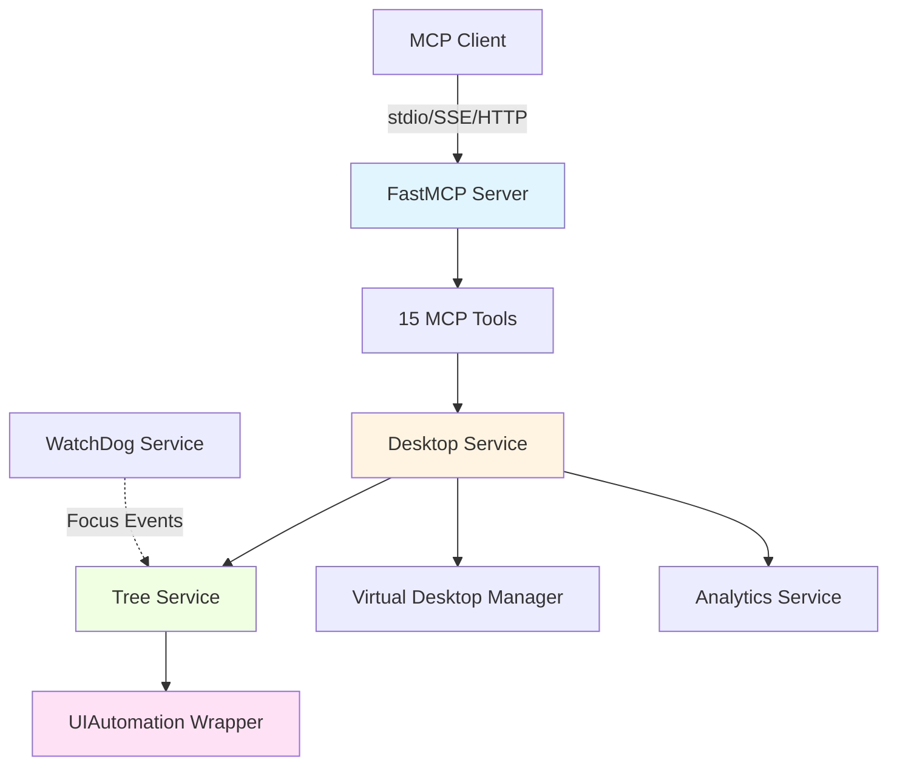
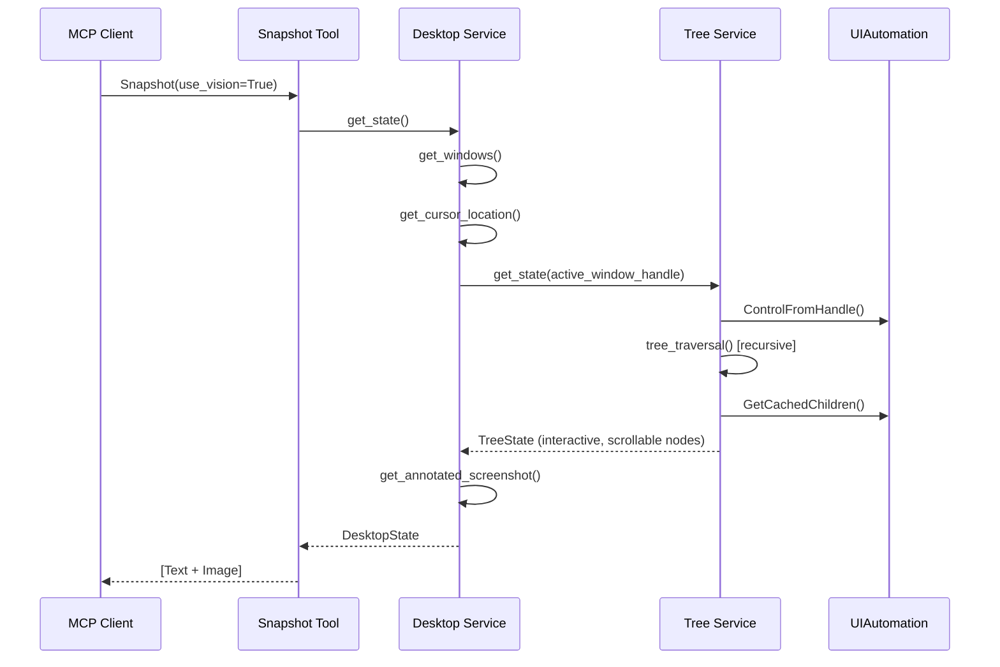
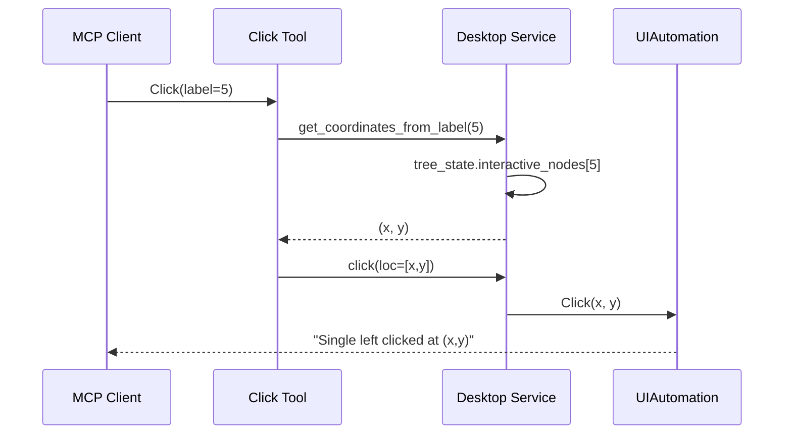

Windows-MCP follows a **layered service architecture** that bridges AI agents with the Windows OS through the Model Context Protocol. The design prioritizes separation of concerns, maintainability, and performance.

## System Overview



## Core Components

<CardGroup cols={2}>
  <Card title="FastMCP Server" icon="server">
    Entry point that registers 15 MCP tools and manages async lifecycle. Handles transport layer (stdio, SSE, streamable-http) and tool routing.
  </Card>
  
  <Card title="Desktop Service" icon="desktop">
    High-level orchestrator for window management, screenshots, mouse/keyboard actions, and clipboard operations.
  </Card>
  
  <Card title="Tree Service" icon="sitemap">
    Captures Windows accessibility tree, identifies interactive elements and scrollable areas using multi-threaded traversal.
  </Card>
  
  <Card title="UIAutomation Wrapper" icon="cube">
    Low-level abstraction over Windows UIAutomation COM API via comtypes for direct OS interaction.
  </Card>
</CardGroup>

## Service Layers

### Entry Point: `__main__.py`

The main entry point coordinates server initialization and tool registration:

- **Tool Registration**: All 15 MCP tools (App, Shell, Snapshot, Click, Type, etc.) are registered on the FastMCP server instance
- **Async Lifespan**: Initializes Desktop, WatchDog, and Analytics services before server start
- **Analytics Decorator**: `@with_analytics` wrapper tracks tool usage telemetry (when enabled)
- **Delegation Pattern**: Each tool function delegates to corresponding `Desktop` service methods

```python
# Lifespan initialization
async def lifespan(app: FastMCP):
    global desktop, watchdog, analytics
    
    if os.getenv("ANONYMIZED_TELEMETRY", "true").lower() != "false":
        analytics = PostHogAnalytics()
    desktop = Desktop()
    watchdog = WatchDog()
    watchdog.set_focus_callback(desktop.tree.on_focus_change)
    
    watchdog.start()
    yield
    
    watchdog.stop()
    if analytics:
        await analytics.close()
```

**Key file**: `src/windows_mcp/__main__.py:48-70`

### Desktop Service: `desktop/service.py`

The **Desktop** service acts as the primary orchestrator:

**Responsibilities**:
- **Window Operations**: Launch apps, resize windows, switch focus, manage window state
- **Screenshot Capture**: Grab screenshots with optional annotation (bounding boxes, labels)
- **Input Simulation**: Mouse clicks, keyboard typing, drag-and-drop, shortcuts
- **Clipboard Management**: Read/write clipboard content
- **PowerShell Execution**: Run system commands with proper encoding handling
- **UI State Coordination**: Interfaces with Tree service for element discovery

**Data Models** (`desktop/views.py`):
- `DesktopState`: Complete desktop snapshot (windows, screenshot, cursor, tree state)
- `Window`: Window metadata (name, status, bounding box, handle, process ID)
- `Size`, `BoundingBox`, `Status`: Supporting data structures

**Key methods**:
- `get_state()`: Captures complete desktop state including UI tree
- `execute_command()`: Runs PowerShell with UTF-8 encoding and PATH reconstruction
- `get_annotated_screenshot()`: Draws bounding boxes and labels on screenshots

**Key file**: `src/windows_mcp/desktop/service.py:69-903`

### Tree Service: `tree/service.py`

The **Tree** service handles Windows accessibility tree traversal:

**Architecture**:
- **Multi-threaded Traversal**: Uses `ThreadPoolExecutor` for parallel window processing
- **Retry Logic**: Built-in retry mechanism with exponential backoff (`THREAD_MAX_RETRIES=3`)
- **Caching Strategy**: Uses UIA cache requests to minimize COM calls and improve performance
- **Sequential Processing**: Windows processed sequentially to avoid COM apartment threading deadlocks

**Node Types Identified**:
- **Interactive Elements**: Buttons, text fields, links, checkboxes (with metadata like focus state, shortcuts, values)
- **Scrollable Areas**: Elements with scroll patterns (with scroll position percentages)
- **Informative Text**: Read-only text content for context
- **DOM Nodes**: Special handling for browser content extraction

**Key Features**:
- **Browser Detection**: Identifies Chrome, Edge, Firefox for DOM extraction mode
- **Fuzzy Matching**: Uses `thefuzz` library for element name matching
- **Focus Change Handling**: Receives focus events from WatchDog to keep tree current
- **Bounding Box Clipping**: Ensures elements are within visible screen/window bounds

**Configuration** (`tree/config.py`):
- `INTERACTIVE_CONTROL_TYPE_NAMES`: Button, Edit, Link, CheckBox, etc.
- `DOCUMENT_CONTROL_TYPE_NAMES`: Document, Image, DataItem
- `INFORMATIVE_CONTROL_TYPE_NAMES`: Text, Heading, Group

**Key file**: `src/windows_mcp/tree/service.py:18-629`

### UIAutomation Wrapper: `uia/`

Low-level abstraction layer over Windows UIAutomation COM API:

**Modules**:
- **`core.py`**: Main automation object wrapper, coordinate utilities, screen info
- **`controls.py`**: Control-specific logic (WindowControl, EditControl, ButtonControl, etc.)
- **`patterns.py`**: UIAutomation patterns (ScrollPattern, ValuePattern, TogglePattern)
- **`enums.py`**: COM enumerations (ControlType, PatternId, PropertyId)
- **`events.py`**: Event subscription handling (focus, structure, property changes)

**Key Capabilities**:
- Direct interaction with Windows UIAutomation COM API via `comtypes`
- Same coordinate space as `BoundingRectangle` (no DPI mismatch)
- Mouse/keyboard input simulation
- Element property retrieval and pattern invocation

### WatchDog Service: `watchdog/service.py`

Background monitoring service for UI state changes:

**Architecture**:
- **Dedicated Thread**: Runs in separate STA (Single-Threaded Apartment) thread for COM safety
- **Event Types**: Focus changes, structure changes, property changes
- **Callback Pattern**: Notifies Tree service when focus changes to keep accessibility tree current
- **Debouncing**: Prevents duplicate events within 1-second window

**Lifecycle**:
1. Initialized during server startup
2. Started in dedicated thread via `start()`
3. Registers UIAutomation event handlers
4. Pumps COM events continuously
5. Cleaned up on shutdown via `stop()`

**Key file**: `src/windows_mcp/watchdog/service.py:23-237`

### Virtual Desktop Manager: `vdm/core.py`

Tracks window-to-desktop associations on Windows 10/11:

**Functionality**:
- **Desktop Enumeration**: Lists all virtual desktops with IDs and names
- **Current Desktop**: Identifies active virtual desktop
- **Window Filtering**: Determines which windows belong to current desktop
- **Multi-Version Support**: Adapts to different Windows builds (10, 11, Server)

**Key Features**:
- COM interface to `IVirtualDesktopManager`
- Registry integration for desktop names
- Fallback support for Windows Server (single desktop)

**Key file**: `src/windows_mcp/vdm/core.py:370-714`

### Analytics Service: `analytics.py`

Optional telemetry tracking:

**Design**:
- **PostHog Integration**: Sends anonymous usage data
- **Privacy-First**: Tracks only tool names and error types (no arguments or outputs)
- **Opt-Out**: Disabled via `ANONYMIZED_TELEMETRY=false` environment variable
- **Decorator Pattern**: `@with_analytics` wrapper instruments tools transparently

**Data Collected**:
- Tool invocation counts
- Error occurrence (type only, no stack traces)
- Session metadata (no user identification)

## Data Flow

### Snapshot Tool Flow



### Click Tool Flow



## Performance Optimizations

<Note>
Windows-MCP includes several optimizations for production use:
</Note>

### Screenshot Capping
Screenshots automatically resize to max **1920x1080** for token efficiency while preserving aspect ratio.

**Implementation**: `src/windows_mcp/__main__.py:35`

### UI Tree Caching
Uses UIAutomation cache requests to batch property reads and minimize COM round trips.

**Implementation**: `src/windows_mcp/tree/cache_utils.py`

### Parallel Window Processing
Tree service processes multiple windows concurrently (with sequential fallback for COM safety).

**Implementation**: `src/windows_mcp/tree/service.py:84-138`

### Retry Logic
Automatic retry with exponential backoff for transient UI automation failures.

**Configuration**: `THREAD_MAX_RETRIES=3` in `tree/config.py`

## Security Considerations

<Warning>
Windows-MCP operates with **full system access** and no sandboxing. Deployment in VMs or Windows Sandbox is recommended.
</Warning>

### Privilege Level
- **Shell Tool**: Can execute arbitrary PowerShell commands
- **App Tool**: Can launch any installed application
- **Process Tool**: Can terminate system processes

### Recommended Deployment
1. **Windows Sandbox**: Isolated environment that resets on close
2. **Virtual Machine**: Full isolation from host system
3. **Dedicated Machine**: Physical hardware reserved for automation

See [Security Policy](https://github.com/CursorTouch/Windows-MCP/blob/main/SECURITY.md) for complete guidelines.

## Thread Safety

### COM Apartment Model
Windows UIAutomation requires **STA (Single-Threaded Apartment)** threading:

- **Main Thread**: Handles MCP tool calls and Desktop service operations
- **WatchDog Thread**: Dedicated STA thread for UIAutomation event monitoring
- **Sequential Processing**: Tree service avoids `ThreadPoolExecutor` for window processing to prevent cross-apartment deadlocks

**Key consideration**: All UIAutomation COM calls must occur in the same STA thread to avoid marshaling issues.

**Implementation**: `src/windows_mcp/tree/service.py:88-92`

## Next Steps

<CardGroup cols={2}>
  <Card title="Operating Modes" icon="toggle-on" href="/concepts/modes">
    Learn about LOCAL and REMOTE deployment modes
  </Card>
  
  <Card title="Transport Options" icon="network-wired" href="/concepts/transports">
    Explore stdio, SSE, and streamable-http transports
  </Card>
  
  <Card title="Tool Reference" icon="tools" href="/tools/snapshot">
    Browse all 17 MCP tools and their parameters
  </Card>
  
  <Card title="Contributing" icon="code" href="/contributing/architecture">
    Deep dive into service APIs and data models
  </Card>
</CardGroup>