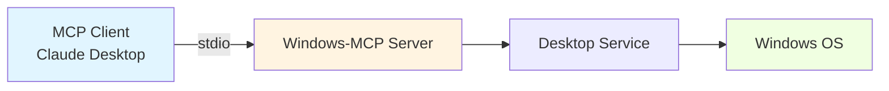
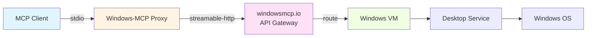

Windows-MCP supports two distinct operating modes to accommodate different deployment scenarios: **LOCAL** (default) and **REMOTE**. The mode is configured via environment variables and determines how the server connects to the Windows automation environment.

## Mode Comparison

<CardGroup cols={2}>
  <Card title="LOCAL Mode" icon="desktop">
    Runs directly on your Windows machine. Standard setup for personal use, development, and direct MCP client connections.
  </Card>
  
  <Card title="REMOTE Mode" icon="cloud">
    Acts as a proxy to windowsmcp.io cloud service. Enables cloud-hosted Windows automation through managed VMs.
  </Card>
</CardGroup>

## LOCAL Mode (Default)

### Overview

In LOCAL mode, Windows-MCP runs directly on your Windows machine and exposes its tools to connected MCP clients. This is the **standard deployment mode** for:

- Personal automation on your own machine
- Development and testing
- Claude Desktop integration
- Direct stdio connections from MCP clients

### Configuration

No environment variables are required. The server defaults to LOCAL mode when `MODE` is not set.

**Basic usage** (stdio transport):

```bash
uvx windows-mcp
```

**With network transports**:

```bash
# SSE transport
uvx windows-mcp --transport sse --host localhost --port 8000

# Streamable HTTP transport
uvx windows-mcp --transport streamable-http --host localhost --port 8000
```

### MCP Client Configuration

<Tabs>
  <Tab title="Claude Desktop">
    ```json claude_desktop_config.json
    {
      "mcpServers": {
        "windows-mcp": {
          "command": "uvx",
          "args": ["windows-mcp"]
        }
      }
    }
    ```
  </Tab>
  
  <Tab title="From Source">
    ```json claude_desktop_config.json
    {
      "mcpServers": {
        "windows-mcp": {
          "command": "uv",
          "args": [
            "--directory",
            "C:\\path\\to\\Windows-MCP",
            "run",
            "windows-mcp"
          ]
        }
      }
    }
    ```
  </Tab>
  
  <Tab title="With Network Transport">
    ```json claude_desktop_config.json
    {
      "mcpServers": {
        "windows-mcp": {
          "command": "uvx",
          "args": [
            "windows-mcp",
            "--transport", "sse",
            "--host", "localhost",
            "--port", "8000"
          ]
        }
      }
    }
    ```
  </Tab>
</Tabs>

### Architecture



**Data Flow**:
1. MCP client connects directly via stdio (or network transport)
2. Windows-MCP server processes tool calls
3. Desktop service interacts with local Windows OS
4. Responses return through same connection

### Use Cases

<CardGroup cols={2}>
  <Card title="Personal Automation" icon="user">
    Automate tasks on your own Windows machine through Claude Desktop or other MCP clients.
  </Card>
  
  <Card title="Development" icon="code">
    Test and develop MCP integrations locally with full access to debugging tools.
  </Card>
  
  <Card title="Enterprise Desktop" icon="building">
    Deploy on company workstations for employee automation (with proper security review).
  </Card>
  
  <Card title="Testing Environment" icon="flask">
    Run in Windows Sandbox or VMs for safe, isolated testing.
  </Card>
</CardGroup>

## REMOTE Mode

### Overview

In REMOTE mode, Windows-MCP acts as a **proxy** that connects to the [windowsmcp.io](https://windowsmcp.io) cloud service. This mode is designed for scenarios where:

- The MCP client is remote (not on the same machine)
- You need cloud-hosted Windows automation
- Windows VMs are managed through the windowsmcp.io dashboard
- Requests are routed through the cloud service to a dedicated VM

### Configuration

REMOTE mode requires three environment variables:

| Variable | Description | Example |
|----------|-------------|---------|
| `MODE` | Set to `remote` | `remote` |
| `SANDBOX_ID` | VM identifier from dashboard | `abc123-vm-01` |
| `API_KEY` | Your Windows-MCP API key | `wmcp_sk_...` |

### MCP Client Configuration

```json claude_desktop_config.json
{
  "mcpServers": {
    "windows-mcp": {
      "command": "uvx",
      "args": ["windows-mcp"],
      "env": {
        "MODE": "remote",
        "SANDBOX_ID": "your-sandbox-id",
        "API_KEY": "your-api-key"
      }
    }
  }
}
```

<Note>
You can still override the transport in REMOTE mode:
```json
"args": ["windows-mcp", "--transport", "sse", "--host", "0.0.0.0", "--port", "8000"]
```
</Note>

### Architecture



**Data Flow**:
1. MCP client connects to local proxy via stdio
2. Proxy authenticates with windowsmcp.io using API key
3. Requests forwarded to designated VM (identified by SANDBOX_ID)
4. VM runs Windows-MCP in LOCAL mode internally
5. Responses proxied back through cloud service

### Authentication Flow

```python
# Authentication happens on proxy startup
client = AuthClient(api_key=config.api_key, sandbox_id=config.sandbox_id)
client.authenticate()  # Validates credentials and gets proxy URL

# Proxy connects to cloud backend
backend = StreamableHttpTransport(
    url=client.proxy_url,
    headers=client.proxy_headers
)
```

**Implementation**: `src/windows_mcp/__main__.py:798-813`

### Use Cases

<CardGroup cols={2}>
  <Card title="Cloud Automation" icon="cloud">
    Run Windows automation from any platform (Mac, Linux, web) through cloud VMs.
  </Card>
  
  <Card title="CI/CD Integration" icon="robot">
    Integrate Windows UI testing into cloud-based CI/CD pipelines.
  </Card>
  
  <Card title="Multi-Tenant SaaS" icon="users">
    Provide Windows automation as a service with isolated VMs per tenant.
  </Card>
  
  <Card title="Remote Support" icon="headset">
    Perform remote Windows troubleshooting and support tasks.
  </Card>
</CardGroup>

### Getting Started

1. **Create Account**: Sign up at [windowsmcp.io](https://windowsmcp.io)
2. **Generate API Key**: Create API key from dashboard
3. **Provision VM**: Create a Windows sandbox/VM
4. **Note Sandbox ID**: Copy the sandbox identifier
5. **Configure Client**: Add environment variables to MCP client config

<Warning>
API keys provide full access to your VMs. Store them securely and never commit to version control.
</Warning>

## Mode Selection Logic

The server determines mode based on the `MODE` environment variable:

```python
config = Config(
    mode=os.getenv("MODE", Mode.LOCAL.value).lower(),
    sandbox_id=os.getenv("SANDBOX_ID", ''),
    api_key=os.getenv("API_KEY", '')
)

match config.mode:
    case Mode.LOCAL.value:
        # Run standard FastMCP server
        mcp.run(transport=transport, host=host, port=port)
        
    case Mode.REMOTE.value:
        # Validate credentials
        if not config.sandbox_id:
            raise ValueError("SANDBOX_ID is required for MODE: remote")
        if not config.api_key:
            raise ValueError("API_KEY is required for MODE: remote")
        
        # Create proxy client
        client = AuthClient(api_key=config.api_key, sandbox_id=config.sandbox_id)
        client.authenticate()
        backend = StreamableHttpTransport(url=client.proxy_url, headers=client.proxy_headers)
        proxy_mcp = FastMCP.as_proxy(ProxyClient(backend), name="windows-mcp")
        proxy_mcp.run(transport=transport, host=host, port=port)
```

**Implementation**: `src/windows_mcp/__main__.py:783-815`

## Environment Variable Reference

### Common Variables

| Variable | Values | Default | Description |
|----------|--------|---------|-------------|
| `MODE` | `local`, `remote` | `local` | Operating mode |
| `ANONYMIZED_TELEMETRY` | `true`, `false` | `true` | Enable/disable analytics |

### REMOTE Mode Variables

| Variable | Required | Description |
|----------|----------|-------------|
| `SANDBOX_ID` | Yes | VM identifier from windowsmcp.io dashboard |
| `API_KEY` | Yes | Authentication key for cloud API |

### Transport Variables

Configured via CLI flags (not environment variables):

```bash
--transport [stdio|sse|streamable-http]  # Default: stdio
--host HOST                               # Default: localhost
--port PORT                               # Default: 8000
```

## Switching Modes

### Local to Remote

**Before** (LOCAL mode):
```json
{
  "mcpServers": {
    "windows-mcp": {
      "command": "uvx",
      "args": ["windows-mcp"]
    }
  }
}
```

**After** (REMOTE mode):
```json
{
  "mcpServers": {
    "windows-mcp": {
      "command": "uvx",
      "args": ["windows-mcp"],
      "env": {
        "MODE": "remote",
        "SANDBOX_ID": "your-sandbox-id",
        "API_KEY": "your-api-key"
      }
    }
  }
}
```

<Note>
Restart your MCP client (e.g., Claude Desktop) after changing configuration.
</Note>

## Troubleshooting

### LOCAL Mode Issues

**Server fails to start**:
- Check that Python 3.13+ is installed
- Verify `uv` or `uvx` is in PATH
- Review logs in MCP client (Claude Desktop logs at `%APPDATA%\Claude\logs`)

**Tools not responding**:
- Ensure Windows UIAutomation is enabled
- Check UAC settings (may require elevation)
- Verify no antivirus blocking automation

### REMOTE Mode Issues

**Authentication fails**:
```
ValueError: API_KEY is required for MODE: remote
```
- Verify `API_KEY` and `SANDBOX_ID` are set in environment
- Check API key is valid (not revoked)
- Confirm sandbox ID matches dashboard

**Connection timeout**:
- Check network connectivity to windowsmcp.io
- Verify firewall allows outbound HTTPS
- Confirm VM is running in dashboard

**Proxy errors**:
- Ensure VM has Windows-MCP installed and running
- Check VM logs for startup errors
- Verify transport compatibility (proxy uses streamable-http)

## Next Steps

<CardGroup cols={2}>
  <Card title="Transport Options" icon="network-wired" href="/concepts/transports">
    Learn about stdio, SSE, and streamable-http transports
  </Card>
  
  <Card title="Installation" icon="download" href="/configuration/claude-desktop">
    Set up Windows-MCP with your MCP client
  </Card>
  
  <Card title="Security" icon="shield" href="/security/overview">
    Review security considerations for deployment
  </Card>
  
  <Card title="Architecture" icon="sitemap" href="/concepts/architecture">
    Understand the layered service architecture
  </Card>
</CardGroup>