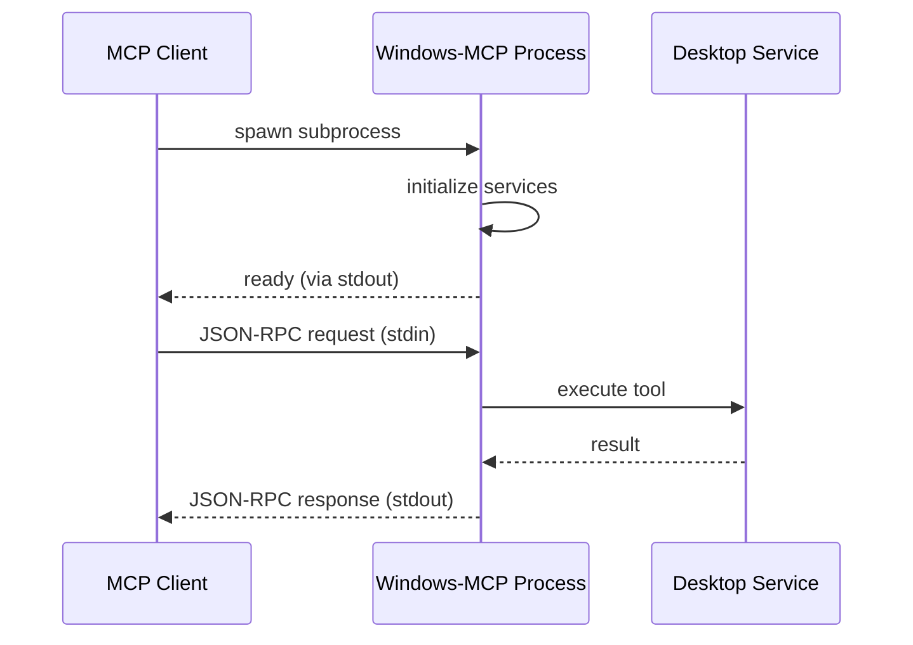
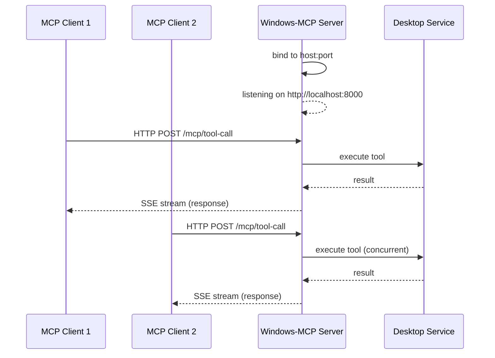
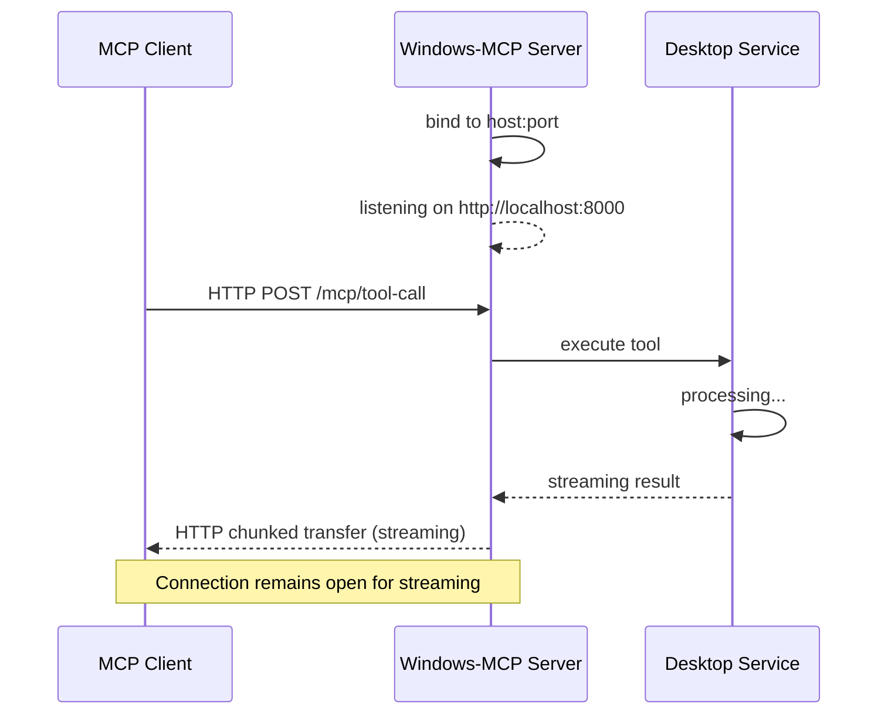
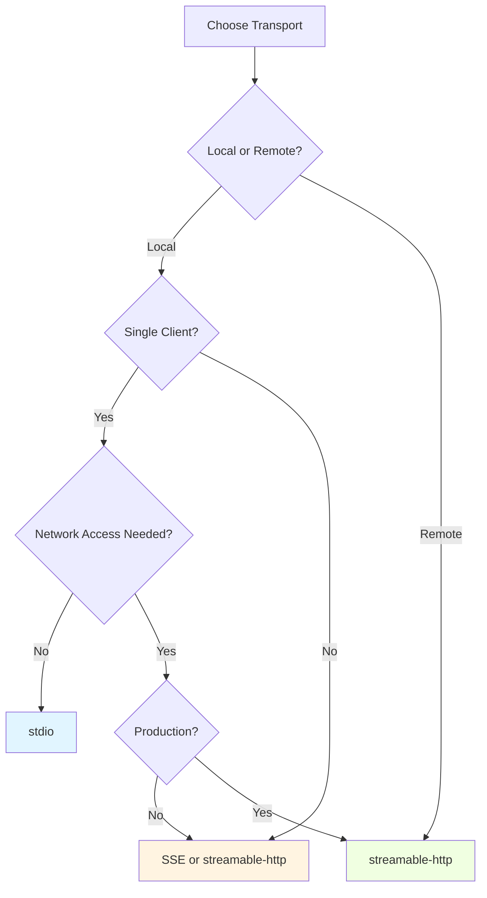

Windows-MCP supports three transport mechanisms for MCP protocol communication: **stdio** (default), **SSE** (Server-Sent Events), and **streamable-http**. The transport determines how the MCP client and server exchange messages.

## Transport Comparison

| Transport | Use Case | Network | Multiple Clients | Best For |
|-----------|----------|---------|------------------|----------|
| **stdio** | Direct process communication | No | No (1:1) | Claude Desktop, local CLIs |
| **SSE** | Network-accessible server | Yes | Yes | Development, testing, webhooks |
| **streamable-http** | Production HTTP streaming | Yes | Yes | Production, cloud, remote access |

## stdio (Standard Input/Output)

### Overview

The **stdio** transport uses standard input/output streams for communication. This is the **default and recommended transport** for:

- Claude Desktop integration
- Cursor IDE integration
- Local MCP CLI tools (Gemini CLI, Qwen Code, Codex CLI)
- Single-client, direct process connections

### How It Works



**Key Characteristics**:
- **Process Lifecycle**: MCP client spawns Windows-MCP as a subprocess
- **Stream-Based**: Requests sent via stdin, responses via stdout
- **Synchronous**: Request/response pairs handled sequentially
- **Isolation**: Each client gets dedicated process instance

### Configuration

**CLI Usage**:
```bash
# stdio is the default (no flags needed)
uvx windows-mcp

# Explicit stdio flag
uvx windows-mcp --transport stdio
```

**MCP Client Config** (Claude Desktop):
```json claude_desktop_config.json
{
  "mcpServers": {
    "windows-mcp": {
      "command": "uvx",
      "args": ["windows-mcp"]
    }
  }
}
```

<Note>
No `--transport` flag is needed for stdio since it's the default.
</Note>

### Advantages

<CardGroup cols={2}>
  <Card title="Simple Setup" icon="check">
    No network configuration, ports, or firewall rules required.
  </Card>
  
  <Card title="Secure by Default" icon="shield">
    No network exposure—communication confined to local process.
  </Card>
  
  <Card title="Standard Integration" icon="plug">
    Works with all MCP-compatible clients (Claude, Cursor, etc.).
  </Card>
  
  <Card title="Process Isolation" icon="lock">
    Each client gets independent server instance with isolated state.
  </Card>
</CardGroup>

### Limitations

- **No Network Access**: Cannot connect from remote machines
- **Single Client**: One client per server process (no sharing)
- **Platform-Specific**: Client must be on same Windows machine

## SSE (Server-Sent Events)

### Overview

The **SSE** transport exposes Windows-MCP as a network server using Server-Sent Events for streaming responses. Designed for:

- Development and testing over network
- Web-based MCP clients
- Debugging and observability
- Multiple concurrent client connections

### How It Works



**Key Characteristics**:
- **HTTP-Based**: Standard HTTP server on configurable host:port
- **Event Streaming**: Responses sent as Server-Sent Events
- **Multi-Client**: Multiple clients can connect simultaneously
- **Persistent**: Server runs continuously (not spawned per client)

### Configuration

**CLI Usage**:
```bash
# Start SSE server on localhost:8000
uvx windows-mcp --transport sse --host localhost --port 8000

# Listen on all interfaces
uvx windows-mcp --transport sse --host 0.0.0.0 --port 8000

# Custom port
uvx windows-mcp --transport sse --host localhost --port 3000
```

**MCP Client Config** (if using as background service):
```json claude_desktop_config.json
{
  "mcpServers": {
    "windows-mcp": {
      "command": "uvx",
      "args": [
        "windows-mcp",
        "--transport", "sse",
        "--host", "localhost",
        "--port", "8000"
      ]
    }
  }
}
```

<Warning>
Binding to `0.0.0.0` exposes the server to your network. Use firewalls or VPNs for security.
</Warning>

### Endpoints

When running with SSE transport, Windows-MCP exposes HTTP endpoints:

| Endpoint | Method | Description |
|----------|--------|-------------|
| `/mcp/tool-call` | POST | Execute MCP tool |
| `/mcp/list-tools` | GET | List available tools |
| `/mcp/health` | GET | Server health check |

**Example Request**:
```bash
curl -X POST http://localhost:8000/mcp/tool-call \
  -H "Content-Type: application/json" \
  -d '{
    "tool": "Snapshot",
    "arguments": {"use_vision": true}
  }'
```

### Advantages

<CardGroup cols={2}>
  <Card title="Network Access" icon="wifi">
    Connect from remote machines on the same network.
  </Card>
  
  <Card title="Multiple Clients" icon="users">
    Handle concurrent connections from different clients.
  </Card>
  
  <Card title="Web Compatible" icon="globe">
    Works with browser-based MCP clients and webhooks.
  </Card>
  
  <Card title="Easy Debugging" icon="bug">
    Use curl, Postman, or browser dev tools to test.
  </Card>
</CardGroup>

### Limitations

- **Security**: No built-in authentication (use firewalls/VPNs)
- **Shared State**: All clients share same server instance
- **Browser CORS**: May require CORS configuration for web clients

### Use Cases

**Development Server**:
```bash
# Start development server accessible to local network
uvx windows-mcp --transport sse --host 0.0.0.0 --port 8000
```

**Testing with curl**:
```bash
# List available tools
curl http://localhost:8000/mcp/list-tools

# Execute Snapshot tool
curl -X POST http://localhost:8000/mcp/tool-call \
  -H "Content-Type: application/json" \
  -d '{"tool": "Snapshot", "arguments": {}}'
```

## streamable-http (Production HTTP)

### Overview

The **streamable-http** transport provides production-ready HTTP streaming. This is the **recommended transport for**:

- Production deployments
- Cloud environments
- Remote access scenarios
- REMOTE mode proxy connections

### How It Works



**Key Characteristics**:
- **HTTP Streaming**: Uses chunked transfer encoding for real-time responses
- **Production-Ready**: Optimized for reliability and performance
- **Load Balancer Compatible**: Works behind proxies and load balancers
- **REMOTE Mode Default**: Used internally by proxy in REMOTE mode

### Configuration

**CLI Usage**:
```bash
# Start streamable-http server on localhost:8000
uvx windows-mcp --transport streamable-http --host localhost --port 8000

# Production configuration
uvx windows-mcp --transport streamable-http --host 0.0.0.0 --port 8000
```

**MCP Client Config**:
```json claude_desktop_config.json
{
  "mcpServers": {
    "windows-mcp": {
      "command": "uvx",
      "args": [
        "windows-mcp",
        "--transport", "streamable-http",
        "--host", "localhost",
        "--port", "8000"
      ]
    }
  }
}
```

### Advantages

<CardGroup cols={2}>
  <Card title="Production Grade" icon="server">
    Designed for reliability, performance, and scalability.
  </Card>
  
  <Card title="Streaming Responses" icon="stream">
    Real-time response streaming for large outputs (screenshots, logs).
  </Card>
  
  <Card title="Proxy Friendly" icon="network-wired">
    Compatible with load balancers, reverse proxies, and CDNs.
  </Card>
  
  <Card title="Cloud Native" icon="cloud">
    Ideal for containerized and cloud deployments.
  </Card>
</CardGroup>

### REMOTE Mode Integration

In REMOTE mode, the proxy automatically uses streamable-http:

```python
# Proxy creates streamable-http backend
backend = StreamableHttpTransport(
    url=client.proxy_url,  # windowsmcp.io endpoint
    headers=client.proxy_headers  # authentication headers
)
proxy_mcp = FastMCP.as_proxy(ProxyClient(backend), name="windows-mcp")
```

**Implementation**: `src/windows_mcp/__main__.py:805`

### Production Deployment

**Docker Example**:
```dockerfile
FROM python:3.13-windowsservercore

RUN pip install uv
RUN uvx install windows-mcp

EXPOSE 8000

CMD ["uvx", "windows-mcp", "--transport", "streamable-http", "--host", "0.0.0.0", "--port", "8000"]
```

**Behind Nginx**:
```nginx
server {
    listen 80;
    server_name windows-mcp.example.com;
    
    location / {
        proxy_pass http://localhost:8000;
        proxy_http_version 1.1;
        proxy_set_header Upgrade $http_upgrade;
        proxy_set_header Connection "upgrade";
        proxy_buffering off;
    }
}
```

## Transport Selection Guide

### Decision Tree



### Recommendations

**Use stdio when**:
- Integrating with Claude Desktop, Cursor, or local CLI tools
- Running on the same Windows machine as the client
- You want the simplest setup with no configuration
- Security is paramount (no network exposure)

**Use SSE when**:
- Developing or testing with network clients
- Building web-based MCP integrations
- You need to debug with curl/Postman
- Multiple developers need shared access

**Use streamable-http when**:
- Deploying to production environments
- Running in cloud or containerized infrastructure
- Using REMOTE mode with windowsmcp.io
- Behind load balancers or reverse proxies
- You need maximum reliability and performance

## CLI Flags Reference

### Transport Flag

```bash
--transport [stdio|sse|streamable-http]
```

**Default**: `stdio`

**Examples**:
```bash
uvx windows-mcp                                    # stdio (default)
uvx windows-mcp --transport stdio                  # explicit stdio
uvx windows-mcp --transport sse                    # SSE
uvx windows-mcp --transport streamable-http        # streamable-http
```

### Host Flag

```bash
--host HOST
```

**Default**: `localhost`

**Applies to**: SSE, streamable-http

**Examples**:
```bash
--host localhost      # Local only
--host 0.0.0.0       # All interfaces (network accessible)
--host 192.168.1.10  # Specific IP
```

### Port Flag

```bash
--port PORT
```

**Default**: `8000`

**Applies to**: SSE, streamable-http

**Examples**:
```bash
--port 8000   # Default
--port 3000   # Custom port
--port 80     # HTTP standard (requires elevation)
```

## Implementation Details

### Transport Resolution

The main entry point handles transport selection:

```python
@click.command()
@click.option(
    "--transport",
    type=click.Choice(["stdio", "sse", "streamable-http"]),
    default='stdio'
)
@click.option("--host", default="localhost", type=str)
@click.option("--port", default=8000, type=int)
def main(transport, host, port):
    match config.mode:
        case Mode.LOCAL.value:
            match transport:
                case "stdio":
                    mcp.run(transport="stdio", show_banner=False)
                case "sse" | "streamable-http":
                    mcp.run(transport=transport, host=host, port=port, show_banner=False)
```

**Implementation**: `src/windows_mcp/__main__.py:761-797`

### FastMCP Integration

All transports use the same FastMCP server instance:

```python
mcp = FastMCP(name="windows-mcp", instructions=instructions, lifespan=lifespan)

# Tools registered once
@mcp.tool(name="Snapshot", ...)
def state_tool(...):
    # Tool implementation

# Transport specified at runtime
mcp.run(transport=selected_transport, host=host, port=port)
```

**Key insight**: The transport is an **implementation detail**—all 15 tools work identically across all transports.

## Security Considerations

### stdio Transport

<CardGroup cols={2}>
  <Card title="✅ Secure by Default" icon="check">
    No network exposure—completely isolated to local process.
  </Card>
  
  <Card title="⚠️ Process Trust" icon="exclamation-triangle">
    Client must trust spawned process (verify uv/uvx installation).
  </Card>
</CardGroup>

### SSE/streamable-http Transports

<Warning>
**Network transports expose full Windows automation to the network. Recommended mitigations:**

- Use firewall rules to restrict access to trusted IPs
- Deploy behind VPN for remote access
- Run in isolated VLAN or Docker network
- Consider adding authentication middleware
- Monitor access logs for suspicious activity
</Warning>

**Example Firewall Rule** (PowerShell):
```powershell
New-NetFirewallRule -DisplayName "Windows-MCP" `
  -Direction Inbound `
  -LocalPort 8000 `
  -Protocol TCP `
  -Action Allow `
  -RemoteAddress 192.168.1.0/24
```

## Troubleshooting

### stdio Issues

**"spawn ENOENT" error**:
- Ensure `uv` or `uvx` is in PATH
- For MSIX Claude Desktop, use full path: `C:\Users\<user>\.local\bin\uv.exe`

**Process hangs on startup**:
- Check for console window prompts (UAC, PowerShell execution policy)
- Review logs at `%APPDATA%\Claude\logs\mcp.log`

### Network Transport Issues

**Port already in use**:
```
Error: Address already in use (port 8000)
```
- Change port: `--port 8001`
- Kill existing process: `taskkill /F /IM python.exe` (use with caution)
- Check what's using port: `netstat -ano | findstr :8000`

**Connection refused**:
- Verify server is running: `curl http://localhost:8000/mcp/health`
- Check firewall allows inbound connections
- Ensure host is `0.0.0.0` for network access (not `localhost`)

**CORS errors** (web clients):
- SSE/streamable-http don't include CORS headers by default
- Consider adding middleware or reverse proxy with CORS support

## Next Steps

<CardGroup cols={2}>
  <Card title="Operating Modes" icon="toggle-on" href="/concepts/modes">
    Learn about LOCAL vs REMOTE deployment modes
  </Card>
  
  <Card title="Installation" icon="download" href="/configuration/claude-desktop">
    Set up Windows-MCP with your preferred transport
  </Card>
  
  <Card title="Architecture" icon="sitemap" href="/concepts/architecture">
    Understand the server architecture
  </Card>
  
  <Card title="Security" icon="shield" href="/security/overview">
    Review security best practices
  </Card>
</CardGroup>